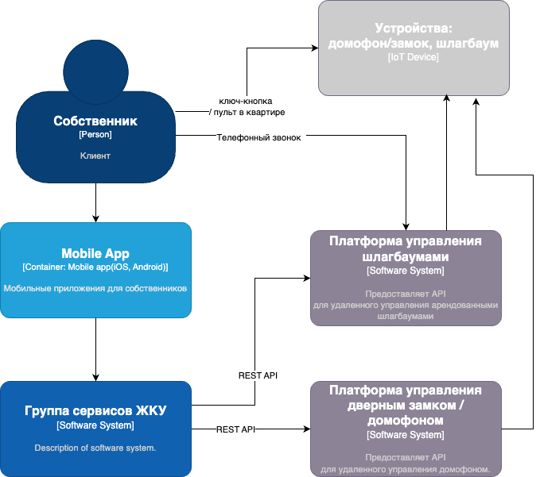
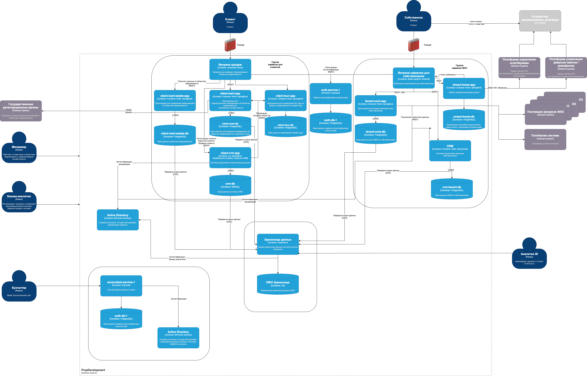

# Задание 3. Внешние интеграции

## 1. Диаграмма контекста в модели С4.

Ссылка на drawio: [Сontext-diagram.drawio](https://drive.google.com/file/d/1K-8coIwDaPdjDZM7D_uw1tOBmQh39D-h/view?usp=drive_link)

## 2. Доработанная  диаграмма контейнеров PropDevelopment.

Ссылка на drawio: [Сontainer-diagram.drawio](https://drive.google.com/file/d/1a8rCaPXJBozvkyrJV1NLdju6ZSHWZcUY/view?usp=drive_link)

## 3. Список требований, которым должны удовлетворить внешние интеграции. 

### Новые компоненты:

- Выделяем сервис `smart-home-app` который будет отвечать за интеграции с компонентами умного дома
и предоставлять нужные API для мобильного приложения клиента.
- У него может быть своя база данных для хранения данных о домах и устройствах привязанных к пользователю.
- Дорабатывается мобильное приложение согласно логике работы с новым сервисом и функционалом.

### Новый функционал:

- Клиент как пользователь продолжает работать через свое мобильное приложение,
но в нем появяются новые функции: удаленно открыть шлагбаум, удаленно открыть дверь,
  добавить авторизованные номера телефона,  история действий (возможно с фото с камеры домофона).
- Дополнительно пользователь может открыть шлагбаум телефонным звонком на указанный номер
- Также пользователь имеет физический доступ к домофону и шлагбауму: через ключ-таблетку, пульт в квартире
- Оператры ЖКХ также имеют доступ в админ-панели ко всем устройствам, во всех домах для мониторинга и удаленного управления.

### Взаимодействие, требования к безопасности:

- **Протоколы коммуникации**: HTTPS (REST API)
  - Используется между мобильным приложением и API сервисами, внутри системы между сервисами, а также при взаимодействии с внешними API.
- **Push-уведомления**:
  - Приложение может получать уведомления о событиях в доме. Безопасность обработки уведомлений обеспечивается Google/Apple.
- **Управление доступом**:
  - Доступ пользователя к функциям умного дома определяется RBAC-политикой:
    - Пользователь имеет доступ на чтение/управление только к устройствам, привязанным к его сущности "home".
    - Доступ к "home" могут получать только пользователи, которым владелец дал разрешение.
- **Взаимодействие с партнерскими API**:
  - Защищено ротируемыми API-ключами.
  - Ограничено по IP-адресам.
  - Продакшен доступен только для DevOps (разработчики не имеют доступа).
  - Обратное оповещение через Webhook Https API (при возникновении событий).
- **Двухфакторная аутентификация**:
  - Приложение должно поддерживать двухфакторную аутентификацию, если она ранее не была внедрена.
- **Логирование и мониторинг**:
  - Все действия логгируются в системе аудита.
  - Логи мониторятся на предмет аномалий.

